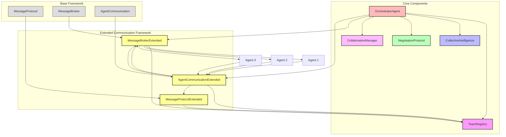

```mermaid
graph TD
    subgraph "Core Components"
        TR[TeamRegistry]
        CI[CollectiveIntelligence]
        NP[NegotiationProtocol]
        CM[CollaborationManager]
        OA[OrchestratorAgent]
    end
    
    subgraph "Extended Communication Framework"
        MPE[MessageProtocolExtended]
        MBE[MessageBrokerExtended]
        ACE[AgentCommunicationExtended]
    end
    
    subgraph "Base Framework"
        MP[MessageProtocol]
        MB[MessageBroker]
        AC[AgentCommunication]
    end
    
    %% Component relationships
    MP --> MPE
    MB --> MBE
    AC --> ACE
    
    OA --> TR
    OA --> CI
    OA --> NP
    OA --> CM
    OA --> MBE
    OA --> ACE
    
    MPE --> TR
    MBE --> TR
    ACE --> TR
    ACE --> MPE
    ACE --> MBE
    
    %% Data flow
    Agent1[Agent 1] --> ACE
    Agent2[Agent 2] --> ACE
    Agent3[Agent 3] --> ACE
    
    ACE --> MBE
    MBE --> Agent1
    MBE --> Agent2
    MBE --> Agent3
    
    style TR fill:#f9f,stroke:#333,stroke-width:2px
    style CI fill:#bbf,stroke:#333,stroke-width:2px
    style NP fill:#bfb,stroke:#333,stroke-width:2px
    style CM fill:#fbf,stroke:#333,stroke-width:2px
    style OA fill:#fbb,stroke:#333,stroke-width:2px
    
    style MPE fill:#ff9,stroke:#333,stroke-width:2px
    style MBE fill:#ff9,stroke:#333,stroke-width:2px
    style ACE fill:#ff9,stroke:#333,stroke-width:2px
    
    style MP fill:#ddd,stroke:#333,stroke-width:1px
    style MB fill:#ddd,stroke:#333,stroke-width:1px
    style AC fill:#ddd,stroke:#333,stroke-width:1px
```
