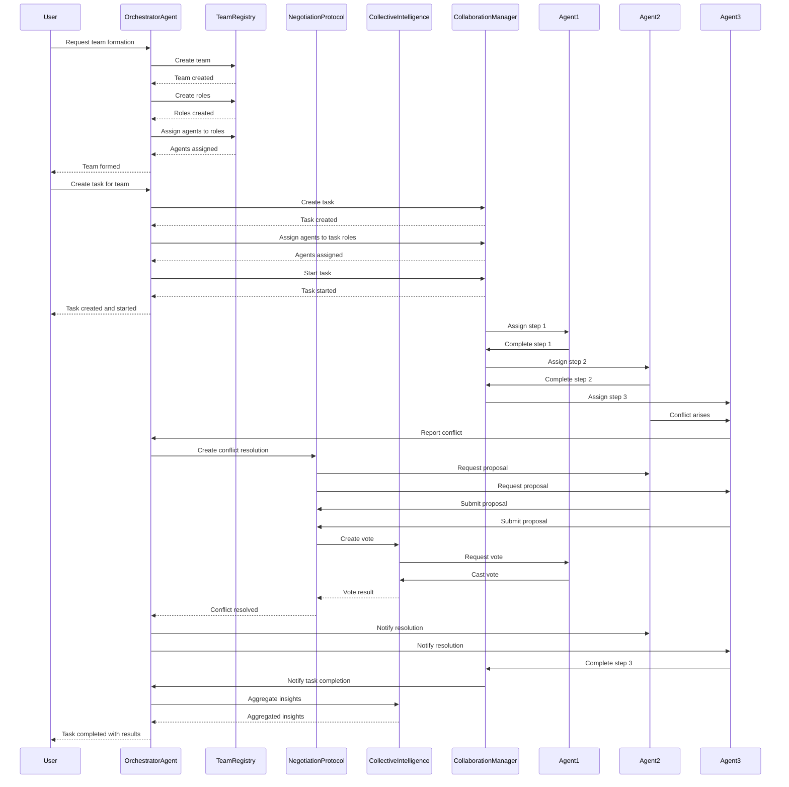

```mermaid
sequenceDiagram
    participant User
    participant OA as OrchestratorAgent
    participant TR as TeamRegistry
    participant NP as NegotiationProtocol
    participant CI as CollectiveIntelligence
    participant CM as CollaborationManager
    participant Agent1
    participant Agent2
    participant Agent3
    
    %% Team Formation
    User->>OA: Request team formation
    OA->>TR: Create team
    TR-->>OA: Team created
    OA->>TR: Create roles
    TR-->>OA: Roles created
    OA->>TR: Assign agents to roles
    TR-->>OA: Agents assigned
    OA-->>User: Team formed
    
    %% Task Creation
    User->>OA: Create task for team
    OA->>CM: Create task
    CM-->>OA: Task created
    OA->>CM: Assign agents to task roles
    CM-->>OA: Agents assigned
    OA->>CM: Start task
    CM-->>OA: Task started
    OA-->>User: Task created and started
    
    %% Task Execution
    CM->>Agent1: Assign step 1
    Agent1->>CM: Complete step 1
    CM->>Agent2: Assign step 2
    Agent2->>CM: Complete step 2
    CM->>Agent3: Assign step 3
    
    %% Conflict Resolution
    Agent2->>Agent3: Conflict arises
    Agent3->>OA: Report conflict
    OA->>NP: Create conflict resolution
    NP->>Agent2: Request proposal
    NP->>Agent3: Request proposal
    Agent2->>NP: Submit proposal
    Agent3->>NP: Submit proposal
    NP->>CI: Create vote
    CI->>Agent1: Request vote
    Agent1->>CI: Cast vote
    CI-->>NP: Vote result
    NP-->>OA: Conflict resolved
    OA->>Agent2: Notify resolution
    OA->>Agent3: Notify resolution
    
    %% Task Completion
    Agent3->>CM: Complete step 3
    CM->>OA: Notify task completion
    OA->>CI: Aggregate insights
    CI-->>OA: Aggregated insights
    OA-->>User: Task completed with results
```
